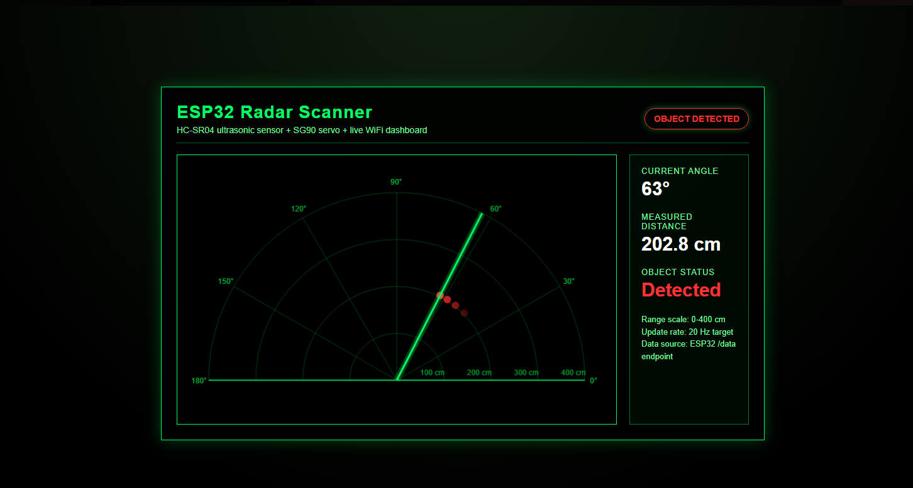
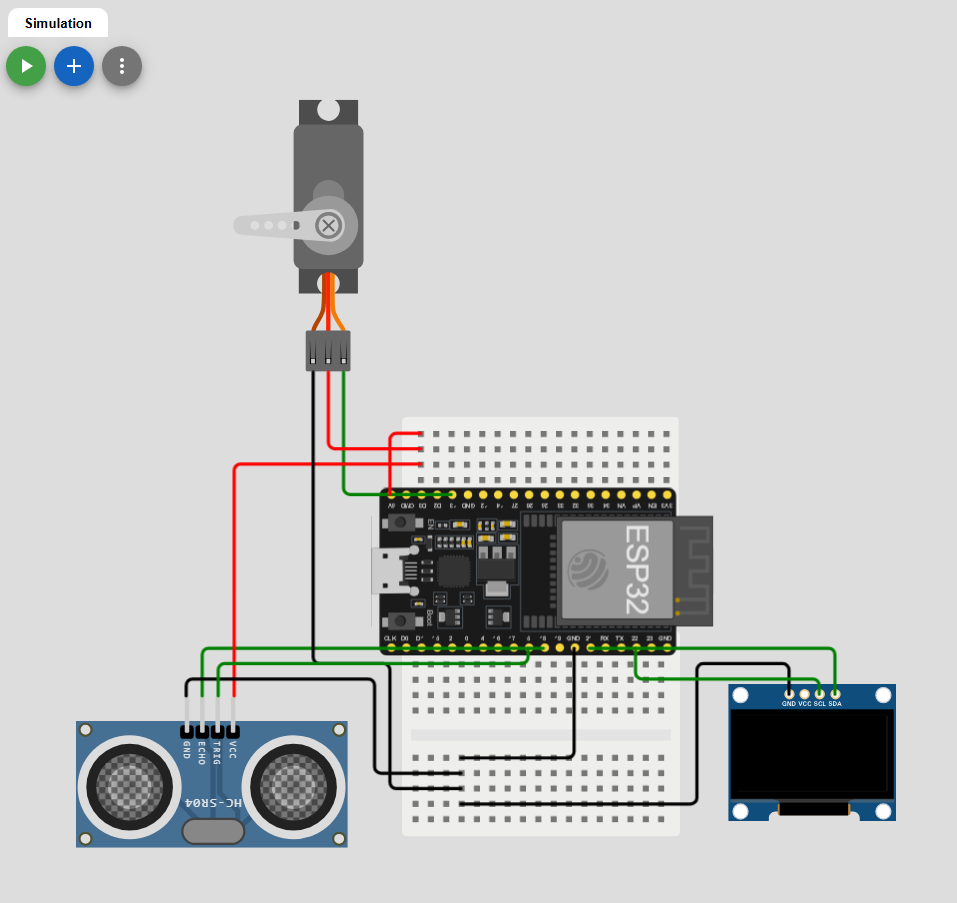
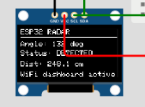

# ESP32 Radar Scanner

ESP32 + HC-SR04 ultrasonic radar scanner with live browser dashboard.

An ESP32-based ultrasonic radar scanner using an HC-SR04 sensor, SG90 servo, OLED display, and live browser dashboard.

The servo sweeps the ultrasonic sensor through 180 degrees. At each angle, the ESP32 measures distance and sends the live angle/distance data to a web dashboard. The OLED also shows the current scan status.

## Current Status

✅ Wokwi simulation working  
✅ Real ESP32 hardware build working  
✅ Live WiFi web dashboard working  
✅ OLED display working  
✅ SG90 servo sweep working  
✅ HC-SR04 ultrasonic distance reading working  
✅ External 5V servo/sensor power supply tested  
✅ Final real hardware photos and demo video captured

## Demo Preview

The project was first tested in Wokwi simulation before being transferred to a real ESP32 breadboard build.  
The simulation was useful for checking the code logic, OLED layout, servo sweep, ultrasonic readings, and web dashboard before powering the physical circuit.

---

### Simulation Preview

#### Web Dashboard Simulation



#### Wokwi Circuit Simulation



#### OLED Display Simulation



---

### Real Hardware Test

After the simulation worked, the circuit was built on a breadboard using the ESP32, HC-SR04 ultrasonic sensor, SG90 servo, OLED display, MT3608 boost converter, switch, and 18650 battery supply.

#### Actual Dashboard


#### Full Hardware View


#### Close-Up Hardware View


#### OLED Close-Up


## Features

- 180 degree servo sweep
- HC-SR04 ultrasonic distance measurement
- Live radar-style browser dashboard hosted by the ESP32
- Object detection status
- OLED display showing:
  - Current angle
  - Distance
  - Object status
  - WiFi dashboard status
- Real hardware build using external 5V supply for the servo and sensor
- Wokwi simulation support
- PlatformIO / Arduino IDE compatible project structure

### Components Used

| Component                 | Purpose                                                         |
| ------------------------- | --------------------------------------------------------------- |
| ESP32 Dev Board           | Main microcontroller and WiFi web server                        |
| HC-SR04 Ultrasonic Sensor | Measures object distance                                        |
| SG90 Servo                | Rotates the ultrasonic sensor through 180 degrees               |
| 0.96 inch I2C OLED        | Displays live scan data                                         |
| MT3608 Boost Converter    | Provides regulated 5V power for the servo and ultrasonic sensor |
| 18650 Battery             | External power source for the 5V rail                           |
| Switch                    | Turns the external servo/sensor supply on and off               |
| Breadboard                | Power and signal distribution                                   |
| Jumper Wires              | Circuit connections                                             |

## Pin Connections

| Module     |    Pin |         ESP32 / Power Connection |
| ---------- | -----: | -------------------------------: |
| HC-SR04    |   TRIG |                           GPIO 5 |
| HC-SR04    |   ECHO | GPIO 18 through resistor divider |
| SG90 Servo | Signal |                          GPIO 13 |
| OLED       |    SDA |                          GPIO 21 |
| OLED       |    SCL |                          GPIO 22 |
| OLED       |    VCC |                       ESP32 3.3V |
| OLED       |    GND |                        ESP32 GND |
| Servo      |    VCC |                 External 5V rail |
| Servo      |    GND |                External GND rail |
| HC-SR04    |    VCC |                 External 5V rail |
| HC-SR04    |    GND |                External GND rail |

## Power Setup

The ESP32 was powered through USB.  
The OLED was powered from the ESP32 3.3V pin.

The SG90 servo and HC-SR04 ultrasonic sensor were powered from a separate 5V rail using an MT3608 boost converter and a single 18650 battery. The MT3608 output was adjusted to approximately 5.0V before connecting the servo and sensor.

All grounds were connected together so the ESP32, servo, ultrasonic sensor, and external power supply shared the same reference.

```text
ESP32 USB power → ESP32 + OLED

18650 battery → MT3608 boost converter → 5V rail
5V rail → SG90 servo + HC-SR04 sensor

MT3608 GND → ESP32 GND
```

## HC-SR04 Echo Protection

The HC-SR04 Echo pin outputs a 5V signal, but the ESP32 GPIO pins use 3.3V logic.  
A resistor divider was used to reduce the Echo voltage before connecting it to GPIO 18.

```text
HC-SR04 Echo → 1kΩ → GPIO 18 → 2kΩ → GND
```

## Demo Video

A short demo video was recorded showing the real hardware build working.  
The video shows the servo sweeping the ultrasonic sensor while the OLED and WiFi dashboard update in real time.

[Watch the demo video](docs/media/radar-demo-v1.mp4)

## Problems Faced and Fixes

| Problem                                                   | Fix                                                    |
| --------------------------------------------------------- | ------------------------------------------------------ |
| ESP32 uses 3.3V logic but HC-SR04 Echo outputs 5V         | Added a resistor divider on the Echo pin               |
| Servo required more current than the ESP32 should provide | Powered the servo from a separate 5V MT3608 supply     |
| MT3608 output needed setting before use                   | Used a multimeter to adjust the output to about 5V     |
| Loose power wire stopped the servo/sensor from working    | Checked the 5V rail and reconnected the loose red wire |
| Dashboard scale was too large for the test area           | Changed max range from 400 cm to 100 cm                |

## Future Improvements

- Replace the temporary taped sensor mount with a 3D printed mount
- Tidy the wiring using shorter jumper cables
- Add an enclosure or base plate for the full circuit
- Add data logging for angle and distance values
- Improve the dashboard with scan history or object tracking

## How It Works

The ESP32 controls the SG90 servo and moves it from 0 to 180 degrees, then back again.

At each angle, the ESP32 triggers the HC-SR04 ultrasonic sensor. The sensor returns an echo pulse, which is used to calculate distance:

```text
distance = (time x speed of sound) / 2
```

The measured angle and distance are sent to the browser dashboard through a `/data` endpoint. The dashboard repeatedly requests this data and redraws the radar display in real time.

## How to Run

1. Open the Arduino IDE project.
2. Install the required libraries:
   - ESP32Servo
   - Adafruit SSD1306
   - Adafruit GFX Library
3. Replace the WiFi name and password in the code:

```cpp
const char* ssid = "YOUR_WIFI_NAME";
const char* password = "YOUR_WIFI_PASSWORD";
```

## Author

**Farhan Ali** — Engineering Student / Embedded Systems Project  
[GitHub](https://github.com/farhan10904) | [Portfolio](https://pacific-attention-6cd.notion.site/Farhan-Ali-Engineering-Portfolio-2c0495dbdc658028a0decf9447459ea6#367495dbdc65808eb791f741fc051231) | [LinkedIn](https://www.linkedin.com/in/farhan-ali-95047a245/)

Built as an independent portfolio project to practise ESP32 development, sensor integration, servo control, power setup, and live dashboard creation.
